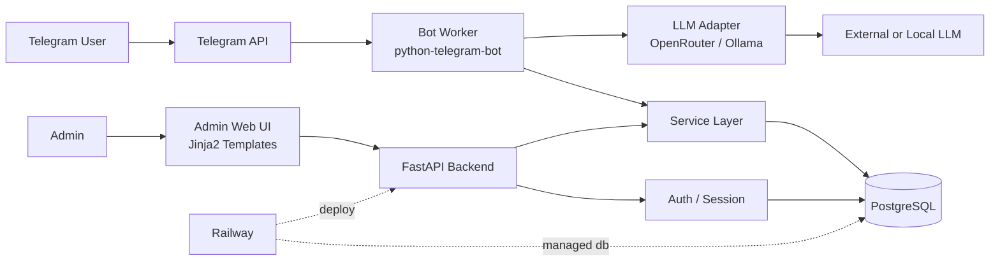
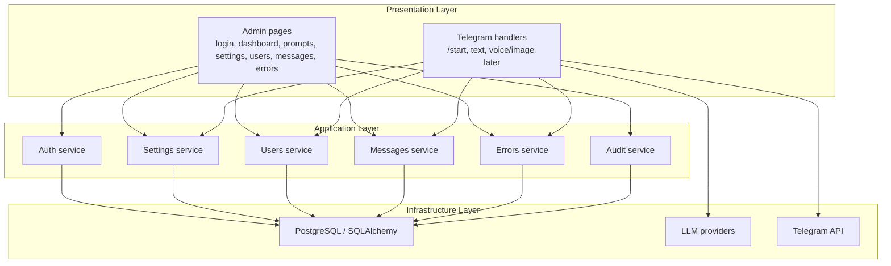
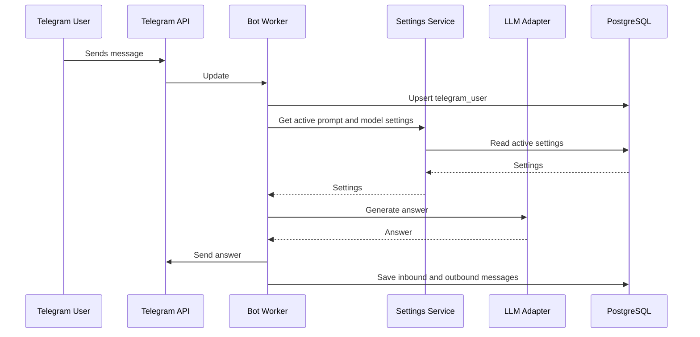
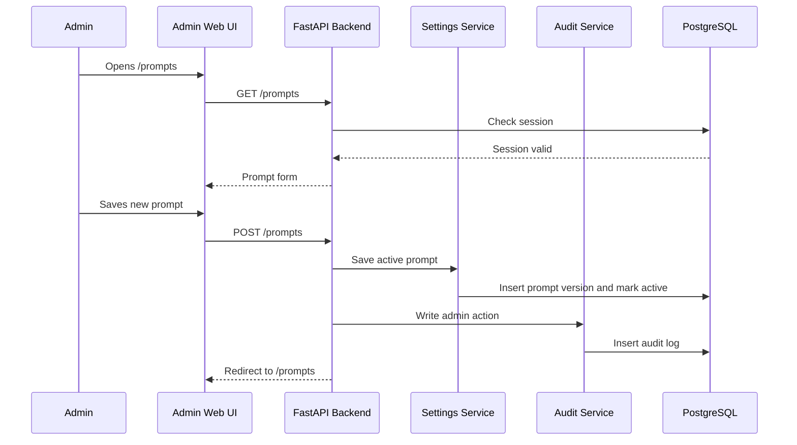
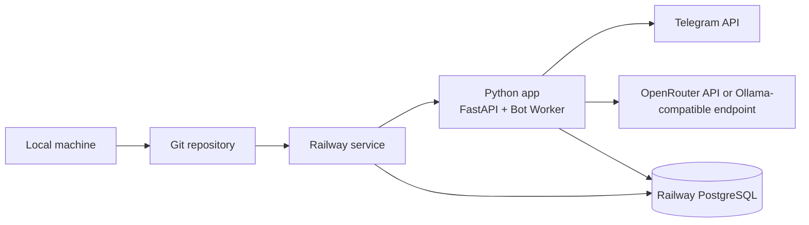

# Architecture: Telegram Bot Admin Panel

## 1. Архитектурный стиль

Для MVP используем модульный монолит:

- один Python-проект;
- один FastAPI backend;
- server-rendered admin UI;
- Telegram Bot Worker внутри того же приложения или отдельным процессом из того же кода;
- PostgreSQL как единое хранилище.

Такой подход проще для учебного проекта, но сохраняет нормальные границы между слоями: `web`, `api`, `services`, `bot_worker`, `db`.

## 2. Component Diagram

## 3. Layer Diagram

## 4. Request Flow: Telegram Message

## 5. Request Flow: Admin Changes Prompt

## 6. Deployment View

## 7. Границы ответственности

| Зона | Что делает | Чего не делает |
| --- | --- | --- |
| `web` | HTML-страницы админки, формы, таблицы | Не содержит бизнес-логику хранения |
| `api` | JSON endpoints для health/internal operations | Не рендерит HTML |
| `services` | Бизнес-операции: settings, users, messages, errors, audit | Не зависит от Telegram UI |
| `bot_worker` | Telegram handlers, получение updates, отправка ответов | Не хранит SQL вручную, использует services |
| `llm` | Единый интерфейс к LLM provider | Не знает о web routes |
| `db/models` | Схема данных и подключение к БД | Не содержит сценарии пользователя |

## 8. Архитектурные решения

1. MVP строится как модульный монолит, потому что это быстрее для учебного запуска и проще деплоится.
2. Admin UI делается server-rendered, чтобы не добавлять frontend build pipeline.
3. Bot Worker и Web Backend используют общий service layer, чтобы не дублировать логику.
4. Секреты хранятся только в env/Railway variables.
5. Voice/image из урока 3 проектируются как расширение после базового текстового MVP.

## 9. Проверка архитектуры

- Можно локально запустить один Python-проект.
- Можно заменить LLM provider без переписывания Telegram handlers.
- Можно вынести Bot Worker в отдельный процесс позже, потому что он уже отделен от web routes.
- Можно добавить роли позже, потому что admin auth изолирован в отдельном модуле.
