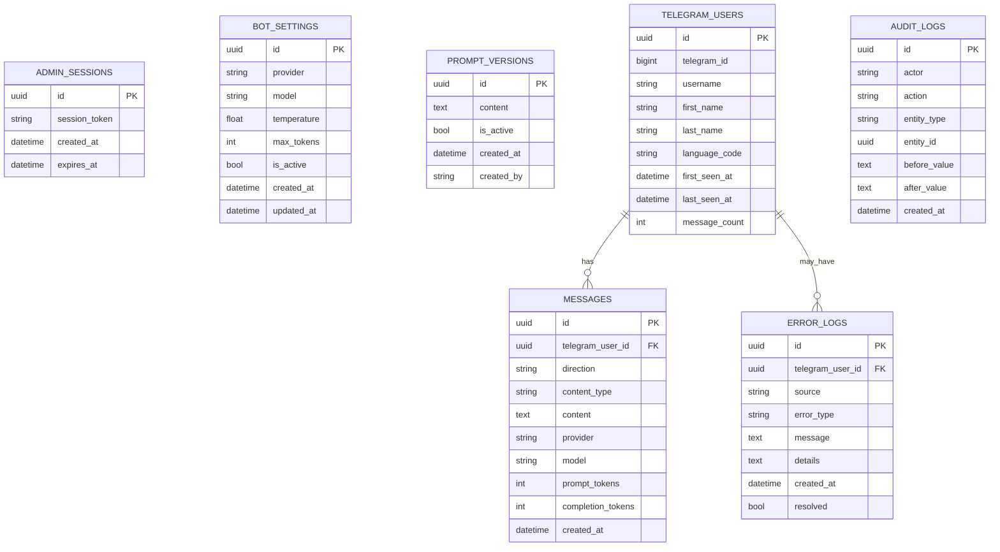

# Data Model: Telegram Bot Admin Panel

## 1. Цель модели

Модель данных должна поддержать MVP:

- хранение настроек бота;
- версионирование system prompt;
- учет Telegram-пользователей;
- историю сообщений;
- журнал ошибок;
- audit log действий администратора;
- admin session для web-панели.

## 2. ER Diagram

## 3. Tables

### `admin_sessions`

Сессии администратора web-панели.

| Поле | Тип | Обязательное | Описание |
| --- | --- | --- | --- |
| `id` | UUID | да | Primary key. |
| `session_token` | string | да | Случайный токен cookie session. |
| `created_at` | datetime | да | Дата создания. |
| `expires_at` | datetime | да | Дата истечения. |

Индексы:

- unique index по `session_token`;
- index по `expires_at`.

### `bot_settings`

Активные настройки LLM.

| Поле | Тип | Обязательное | Описание |
| --- | --- | --- | --- |
| `id` | UUID | да | Primary key. |
| `provider` | string | да | `openrouter`, `ollama` или другой provider. |
| `model` | string | да | Название модели. |
| `temperature` | float | да | Температура генерации. |
| `max_tokens` | int | да | Максимум токенов ответа. |
| `is_active` | bool | да | Активная конфигурация. |
| `created_at` | datetime | да | Дата создания. |
| `updated_at` | datetime | да | Дата обновления. |

Правило:

- в MVP активной считается одна запись `is_active = true`;
- при изменении можно обновлять текущую запись или создавать новую версию. Для учебного MVP достаточно обновления + audit log.

### `prompt_versions`

Версии system prompt.

| Поле | Тип | Обязательное | Описание |
| --- | --- | --- | --- |
| `id` | UUID | да | Primary key. |
| `content` | text | да | Текст system prompt. |
| `is_active` | bool | да | Активная версия. |
| `created_at` | datetime | да | Дата создания. |
| `created_by` | string | да | Кто создал версию, для MVP `admin`. |

Правило:

- только один active prompt;
- новая версия не удаляет старую.

### `telegram_users`

Пользователи Telegram-бота.

| Поле | Тип | Обязательное | Описание |
| --- | --- | --- | --- |
| `id` | UUID | да | Primary key. |
| `telegram_id` | bigint | да | ID пользователя Telegram. |
| `username` | string | нет | Telegram username. |
| `first_name` | string | нет | Имя. |
| `last_name` | string | нет | Фамилия. |
| `language_code` | string | нет | Язык Telegram-клиента. |
| `first_seen_at` | datetime | да | Первый контакт. |
| `last_seen_at` | datetime | да | Последний контакт. |
| `message_count` | int | да | Количество входящих сообщений. |

Индексы:

- unique index по `telegram_id`;
- index по `last_seen_at`.

### `messages`

История входящих и исходящих сообщений.

| Поле | Тип | Обязательное | Описание |
| --- | --- | --- | --- |
| `id` | UUID | да | Primary key. |
| `telegram_user_id` | UUID | да | FK на `telegram_users.id`. |
| `direction` | string | да | `inbound` или `outbound`. |
| `content_type` | string | да | `text`, `voice`, `image`, `system`. |
| `content` | text | нет | Текст сообщения или расшифровка. |
| `provider` | string | нет | LLM provider для исходящего ответа. |
| `model` | string | нет | Модель для исходящего ответа. |
| `prompt_tokens` | int | нет | Токены prompt, если provider возвращает usage. |
| `completion_tokens` | int | нет | Токены ответа. |
| `created_at` | datetime | да | Дата сообщения. |

Правило:

- для MVP можно хранить полный текст сообщений;
- если проект станет публичным, нужно добавить retention policy и privacy notice.

### `error_logs`

Ошибки приложения и бота.

| Поле | Тип | Обязательное | Описание |
| --- | --- | --- | --- |
| `id` | UUID | да | Primary key. |
| `telegram_user_id` | UUID | нет | FK на пользователя, если ошибка связана с update. |
| `source` | string | да | `bot`, `web`, `llm`, `db`, `telegram`. |
| `error_type` | string | да | Тип ошибки. |
| `message` | text | да | Короткое сообщение. |
| `details` | text | нет | Stack trace или технический фрагмент. |
| `created_at` | datetime | да | Дата ошибки. |
| `resolved` | bool | да | Отмечена ли ошибка как решенная. |

### `audit_logs`

История действий администратора.

| Поле | Тип | Обязательное | Описание |
| --- | --- | --- | --- |
| `id` | UUID | да | Primary key. |
| `actor` | string | да | Для MVP `admin`. |
| `action` | string | да | Например `prompt.updated`, `settings.updated`. |
| `entity_type` | string | да | Тип сущности. |
| `entity_id` | UUID | нет | ID сущности. |
| `before_value` | text | нет | Предыдущее значение или JSON. |
| `after_value` | text | нет | Новое значение или JSON. |
| `created_at` | datetime | да | Дата действия. |

## 4. Начальные данные

При первом запуске нужно создать:

- active prompt:
  - `Ты полезный Telegram AI-ассистент. Отвечай кратко и понятно.`
- active bot settings:
  - provider: `ollama`
  - model: `llama3.2:3b`
  - temperature: `0.3`
  - max_tokens: `800`

## 5. Правила удаления

Для MVP физическое удаление не требуется.

Рекомендуемый подход:

- prompt versions не удалять;
- messages не удалять в MVP;
- error logs можно помечать `resolved`;
- telegram users не удалять вручную до появления privacy workflow.

## 6. Проверка модели

Модель считается достаточной для MVP, если можно ответить на вопросы:

- какой prompt сейчас активен;
- какая модель сейчас активна;
- кто писал боту;
- какие сообщения были отправлены и получены;
- какие ошибки были в работе;
- кто и когда изменил настройки.
